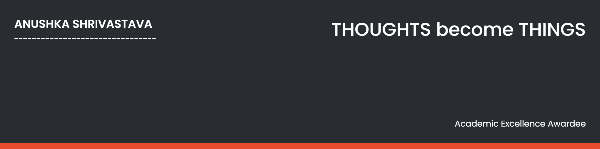

"#anushka00" 
💻I'm a computer science engineer

## 👩🏼‍💻 About Me

- 🌱 I’m currently learning **React,JS,Nodejs**

-  🤖Learning **DSA** 

- 📫  Contact me **[here](anushkashrivastava22@gmail.com)**

## 📚 My Skills

<!--  -->

## 🤝 Connect

